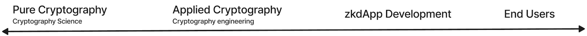
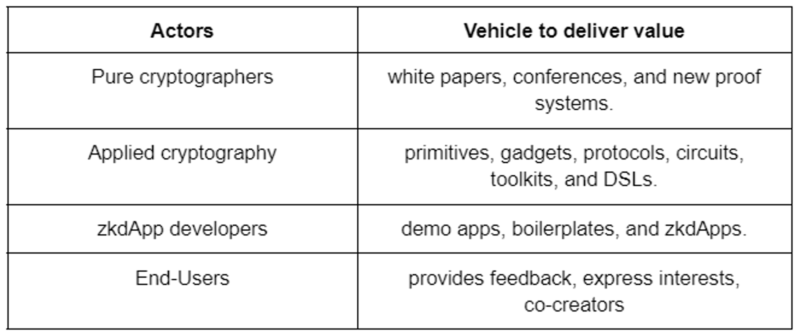
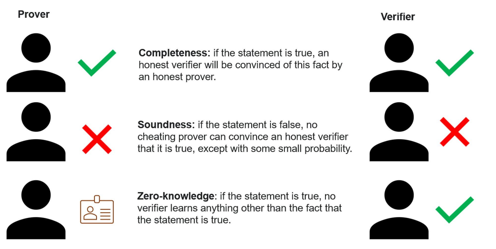

当我加入[PSE 团队](https://appliedzkp.org/)开始，学习[零知识](https://en.wikipedia.org/wiki/Zero-knowledge_proof)就像从消防水带里喝水一样。有很多基础知识需要快速学习。这个领域有很多项目，而且每周都会出现新项目。一直以来，零知识不断经历着深度的理论创新。

通过这一系列文章，我打算分享我的经验，通过解决问题的角度，带你们发现和分类零知识 (ZK) 项目和应用程序。这意味着重点是项目旨在解决_什么问题。_我不太关注它是_如何_实现的。换句话说，除了“零知识应用”这一通用的术语外，它们的底层证明系统、领域特定语言 ( [DSL](https://www.youtube.com/watch?v=kqnYbSmdcbA) )、递归证明和电路可能有很大差异。

这些文章旨在强调生态系统未来的优势和机遇，并确定投资不足的领域。我也希望这能促进生态系统中产品间的协作，尤其是在同一问题空间中的项目。

本系列将至少包括以下主题：简介、隐私和身份 ( **zkID** )、隐私金融 ( **zkDeFi** )、隐私计算 ( **zkComp** )、扩容和互操作性。

# 什么是零知识应用程序？

零知识应用程序是允许用户彼此共享信息，而无需透露其身份或信息内容的应用程序。这些应用程序使用各种加密技术，特别是[零知识证明](https://en.wikipedia.org/wiki/Zero-knowledge_proof)，以确保信息保密，即使是运行应用程序的人也是如此。零知识应用程序的目标是为用户提供一种安全、私密和简洁的的方式，来交流和分享敏感信息。

# 为什么人们要在以太坊上构建它们？

随着社会规模、复杂性和宏伟目标的扩张，对公平、高效的协调系统和技术的需求也在增加。以太坊是[世界计算机](https://inevitableeth.com/en/home/ethereum/world-computer)，一个全球共享的计算平台，存在于由 1,000 个计算机节点组成的网络空间中。它是世界的结算层和中立的真相来源。

尽管以太坊提供透明性、不变性和去中心化，但它可能并不能提供某些用例所需的隐私级别。通过将区块链与零知识证明 (ZKP) 相结合，可以创建一个既提供区块链的不变性，又提供 ZKP 的隐私性的系统。这种组合可以为用户提供一种强大的方式来保护他们的数据，同时仍然可以利用以太坊的优势。

# 创新如何影响最终用户？

在较高的层面上看，该领域的创新通过以下方式影响用户：纯密码学创新支持应用密码学，从而支持最终为终端用户服务的 zkdapp 开发。

加密价值流

*注意：这是分析零知识价值流的一个角度；然而，在现实中，还有其他参与者，如基础设施提供商、硬件加速器、数据提供商等，也为这一价值流做出了巨大贡献。*

为生态系统创造价值的参与者和工具

了解这个范围和关系有助于确定组织和可能的合作关系，以及确定每个领域的主要参与者。

类似上述的框架也有被提出过。其中一个例子是[PARC Squad](https://0xparc.org/blog/parc-squad)，他们分成 `理解 <> 创新 <> 构建 <> 交付`四层。然而，重要的是需要一个覆盖最后一英里的“生产化”层，以将这种创新交付给最终用户。

# **如何对不同类型的应用程序进行分类？**

对零知识领域进行分类的一种方法是首先将其分解为隐私性、可扩展性和互操作性。还有其他方法来划分零知识，但是，上述类别源自零知识证明的三个内在属性：

零知识证明必须满足三个属性

以这三个属性为指导，我们可以观察到与类别的相似之处：

-   **完备性**  *实现*  **互操作性**：如果数据存在或交易发生在另一个区块链上，并且证明得到验证，则可以将此信息从一个“链”带到另一个“链”上。例如以太坊Layer 2中的互操作性（L2<>L2 和 L1<>L2）
-   **可靠性** *实现* **简洁性** *从而实现* **可扩展性**：随着错误声明的概率接近于零（可靠性），我们可以自信地将多个证明聚合为一个证明，一种方法是通过[递归证明](https://coingeek.com/recursive-zero-knowledge-proofs-proof-of-a-proof-of-a-proof/)。通过这种方式，可以将单个证明提交给以太坊并简洁地验证 1000 笔交易或Claim。
-   **零知识** 实现 **隐私**：如果证明除了证明所声称的内容之外没有透露任何其他个人信息，我们就能保护隐私。

后续文章中提到的项目将包含其中一个或多个特征。当零知识属性不存在时，部分行业更精确地引用“简洁证明”而不是“零知识证明”，但是出于本系列学习的目的，我们将两者放在同一范畴下。

# **下一步是什么？**

在下一篇文章中，我们将探讨**隐私和身份 (zkID)** 领域。解释隐私意味着什么，哪些信息流与控制，探索子类别中的示例应用程序例如：credential bridges、zkCompliance、zkGovernance、zkSocial Networks、Identity Aggregators等等！

*23/01/23 注释：上面提到的内在属性不是“正式”推导，而是一种在概念上将它们联系起来的方式。实际上，互操作性和可扩展性都需要保证完备性和可靠性。可扩展性来自递归性，特别是因为证明生成与验证的计算时间的不对称性质。*