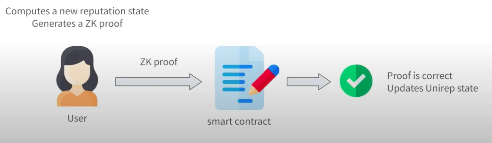
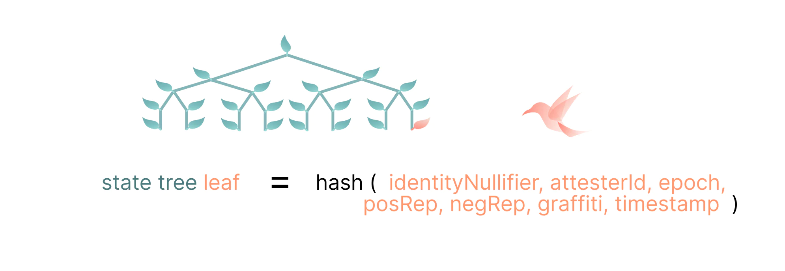

匿名为人们提供了一个全新的平台来表达自己，与现有身份无关。声誉提供了背景：它揭示了一个人的历史相对于他人的一个方面。[UniRep 协议](https://github.com/unirep)为匿名性增加了声誉，允许人们在不透露其历史细节的情况下提供关系上下文。

UniRep 代表[Universal Reputation](https://mirror.xyz/privacy-scaling-explorations.eth/S04tvQuLbRjf_9ZrzDTE0T2aho9_GoSuok5NEFyHNO4)，作为基础层使用可互操作的智能合约在多个社区中应用声誉，同时通过[零知识证明](https://ethereum.org/en/zero-knowledge-proofs/)保护用户隐私。

# 通用的声誉

声誉是相互关联的：它建立在对一个人的行为或人格的声明之上。它同样也是主观的和背景相关的。它可以采用定性的形式，例如来自熟人的推荐信或 Airbnb 评论，也可以是 Reddit 上的赞成票或反对票，或者数据库中的正整数或负整数。如果没有声誉作为参考，我们依赖的许多应用程序和服务将无法运行，无法决定如何与互联网上的陌生人互动。

UniRep 协议是一种标准，不同的信誉规则可以在其上进行互操作。它不规定给定应用程序中如何使用信誉，而是作为一个通用和[可扩展](https://www.youtube.com/watch?v=jd2Dg9czJzI&list=PLV91V4b0yVqRQ62Mv0nUgWxJhi4E67XSY&index=5)的系统运行，AirBNB、Uber、Reddit、Medium、Trip Advisor 或 Trust Pilot 等平台将成为[证明者](https://developer.unirep.io/docs/protocol/users-and-attesters)：正面或负面的声誉提供者。

证明者在应用层。他们是零知识社交生态中的平台、商家和社群。他们充当世界建设者和社区管理者。证明者在构建什么方面具有很大的灵活性。他们可以决定使用用户身份、用户如何上线以及用户如何相互交互。最重要的是，证明者决定了为什么某人获得正面声誉以及为什么某人获得负面声誉。换句话说，证明者承担相应的责任。

证明者使用公开的以太坊地址，而用户身份始终保密。用户从证明者那里获得声誉，并创建一个零知识证明来验证他们从某个证明者那里获得的一定的声誉。

UniRep 用户始终可以控制如何使用他们的声誉：只有他们才能看到他们积累了多少，只有他们才有权力透露他们的声誉——而且只透露给他们想要透露的人。

# UniRep 的工作原理：为匿名添加责任

UniRep 协议是从[Barry WhiteHat 的一项 ethresearch 提案](https://ethresear.ch/t/anonymous-reputation-risking-and-burning/3926)演变而来的，该提案提出这样一个系统，即使用户是匿名的，也可以禁止用户或销毁他们的声誉。该提案的机制中，用户必须接受所提供的正面和负面声誉，同时保持隐私。为了保证声誉是不可否认的（不能被拒绝），UniRep 采用了一个epochs、临时身份的系统，通过零知识证明将声誉和用户信息从一个状态转换到另一个状态。

## 临时身份

通过称为[epoch keys](https://developer.unirep.io/docs/protocol/epoch-key)升级身份为用户积累声誉。Epoch keys可以被认为是定期更改但与用户永远相关联的临时以太坊地址，它为用户保留匿名性，同时保留有意义的声誉所需的历史记录。

[Epochs](https://developer.unirep.io/docs/protocol/epoch)代表时间的流逝。类似于区块链中的块，它们可以被认为是 UniRep 系统中的周期：随着每次转换，所有用户的声誉余额都会最终确定，并转移到新的epoch中。每个证明者可以设置自己的epoch长度。

Epoch keys是根据通过[Semaphore](https://semaphore.appliedzkp.org/)生成的[身份承诺](https://semaphore.appliedzkp.org/docs/guides/identities)创建的，Semaphore是一个通用的隐私层，用户可以在其中匿名地从组内发送信号。在Semaphore组内部，用户的操作与其“外部”身份无关。Semaphore身份不是作为个体的唯一标识来与人互动，而是简单地表示为组的成员。

Epoch keys在每个epoch都会改变，对每个用户而言都是唯一的，并且看起来完全随机。只有用户知道他们是否正在接受证明或声誉；其他人只会看到对随机值的证明。Epoch和不断变化的epoch通过混淆声誉累积以及人们用来交互的身份来帮助保护隐私。*（注：这一点和UTXO很像，用户拥有许多证明者主体所提供的证明）*

## 关于树的一切

UniRep 使用[Merkle tees](https://www.youtube.com/watch?v=YIc6MNfv5iQ)系统来同时维护声誉和隐私。Merkle树是能够高效存储和验证信息的数据结构；信誉和用户数据作为叶子存储在 UniRep 的 Merkle 树中。验证 UniRep 信誉意味着生成用户声明（他们的信誉级别）存在于有效 Merkle 树中的证明。

当用户第一次注册时，他们的数据被输入到[状态树](https://developer.unirep.io/docs/protocol/trees#state-tree)中。每个证明者都有自己独立的状态树版本，每个时期都会发生变化。状态树可以被认为是特定证明者的信誉追踪器的元数据：包含相关的 UniRep 用户，及其在epoch开始时的初始信誉。

由于 epoch 密钥是临时的，因此它们积累的声誉必须迁移到新的 Merkle 树。当用户过渡到新epoch时，他们会收到新的epoch keys，而旧的epoch keys将失效。在后台，他们的声誉通过零知识证明跟随至证明者状态树的下一次更新。迁移到新的状态树意味着创建一个[用户状态转换证明](https://developer.unirep.io/docs/circuits-api/circuits#user-state-transition-proof)来验证用户是否遵守协议的所有规则。证明可以表明没有作弊：没有遗漏负面证明或添加欺诈的正面证明。

用户生成一个用户状态转换证明，其中包含一个新的状态树叶子，里面包含证明者 ID、用户的[Semaphore identity nullifier](https://semaphore.appliedzkp.org/docs/guides/identities)、用户在前一个时期的正面和负面声誉的总和、时间戳和“graffiti”——证明者赋予用户的值。这个新叶子被提供给智能合约，它验证证明并将其插入到新的状态树中。

一旦用户积累了声誉，他们就可以通过[声誉证明](https://developer.unirep.io/docs/circuits-api/reputation-proof)来证明他们积累了多少声誉点数。信誉证明是一种零知识证明，可验证用户是否存在、是否具有声明的信誉并已执行所有必要的转换或迁移。信誉证明确保用户的声明与状态树中的数据一致。

# 零知识社交栈

与此同时，业内有许多在重新构想和构建在线社的交系统，使其更加去中心化、无需许可和抗审查。尽管方法不同，但所有这些方案都在为身份和声誉创建基础的模块，然后使用不同的方式来堆叠结构。

[去中心化身份（DID）](https://www.w3.org/TR/2022/REC-did-core-20220719/#abstract)、[去中心化社交（DeSoc）](https://papers.ssrn.com/sol3/papers.cfm?abstract_id=4105763)、[p2p网络](https://scuttlebutt.nz/about/)和[联盟空间](https://eric442.substack.com/p/what-is-the-fediverse-0d6)或[网络](https://blueskyweb.xyz/blog/10-18-2022-the-at-protocol)等在努力允许任何人加入、表达自己，并可以自由选择与他人联系/参与的方式。在这些系统中，用户拥有自己的账户、数据和社交图谱；用户可以自己选择与网络的交互方式；默认情况下，独立的服务器或系统能够相互通信。

当我们听到“社交应用程序”时，我们往往会想到 Twitter 或 Reddit 等社交媒体平台——但餐厅评价、市场、拼车和寄宿家庭都是高度社交化，并且高度依赖于可靠的声誉系统。零知识社交或[零知识身份](https://0xparc.org/blog/zk-id-2)也需要前面提到的去中心化社会工作的许多原则，但零知识社交以隐私作为基础层构建——这在像寄宿家庭这样“现实生活”的用例中尤为重要——使用零知识证明作为对身份或声誉进行声明的主要机制。UniRep 协议是 ZK 社交栈中的一个基础模块。

将复杂性和数据添加到匿名系统，可以让人们重新获得无法识别个体用户时所丢失的信息。从头开始构建社会原语意味着，必须考虑和试验新的方法来对约束、规则和反馈机制进行分层。

最终，有趣的、多维的、用户拥有的、隐私保护的数字身份和信誉系统——所有互操作性的——将有望出现。但现在还为时尚早。Semaphore 和 UniRep 等协议旨在作为社交堆栈基建的基础模块。这些原语无法决定支持零知识的社交未来会是什么样；这将只能由用户、证明者和构建者决定。

# 下一步

UniRep 仍处于开发的早期阶段，但该团队已经在着手开发协议的[下一版本](https://github.com/Unirep/Unirep/issues/134)，旨在通过降低创建零知识证明的复杂性，使系统更易于定制，更易于证明者使用，并更具可扩展性。

您可以尝试使用 UniRep 协议构建的[演示应用](https://unirep.social/)，它类似于 Reddit，但默认具有匿名性和隐私性。

如果您想帮助构建下一版本的[UniRep 协议](https://github.com/unirep)或将此匿名声誉层集成到您的项目中，请查看[文档](https://developer.unirep.io/docs/welcome)并在此处加入[UniRep Discord](https://discord.gg/VzMMDJmYc5)。

感谢[Vivian](https://github.com/vivianjeng)、[Chance](https://github.com/vimwitch)、[Doris](https://github.com/kittybest)、[Anthony](https://github.com/AnthonyMadia)、[Yuriko](https://github.com/yuriko627)、[CJ](https://github.com/CJ-Rose)和[Chiali](https://github.com/ChialiTsai)的贡献，是因为它们，UniRep 协议才得以实现。