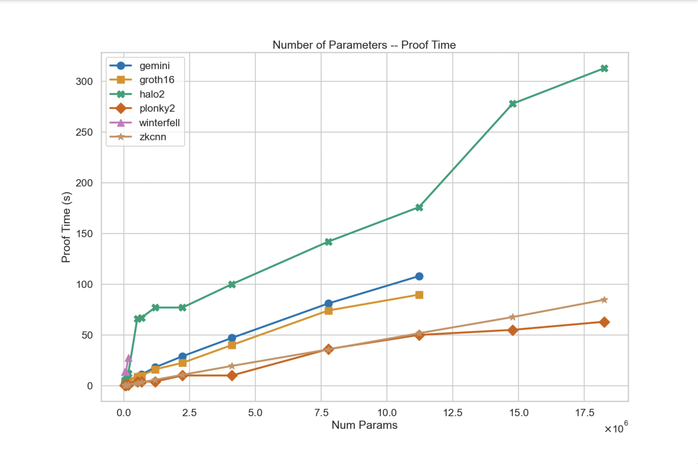
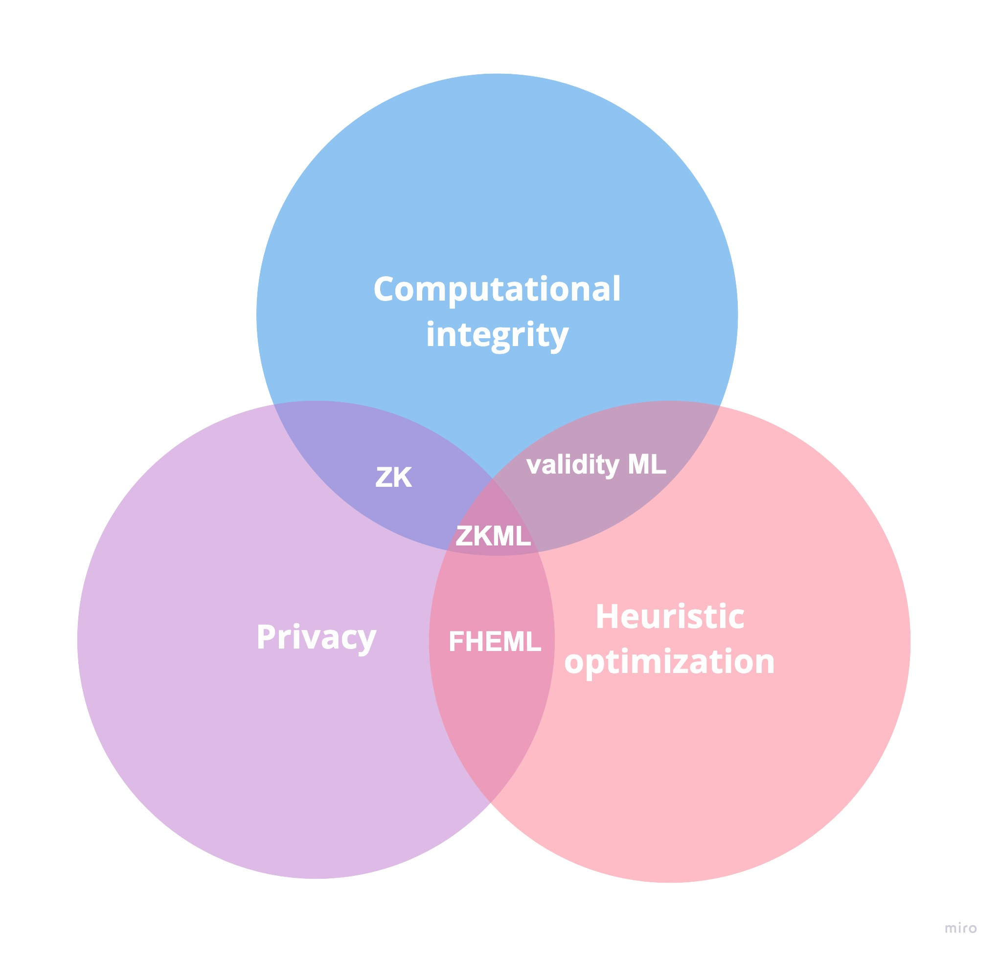

零知识机器学习（ZKML）是最近在密码学界掀起波澜的一个研究领域。那么它是什么，为什么会有用？首先，让我们将该术语分解为两个部分并解释它们是什么。

## ZK是什么

零知识证明是一种密码协议，其中一方（证明者）可以向另一方（验证者）证明给定的声明是真实的，而无需透露除了声明是真实的事实之外的任何其他信息。这是一个在各个方面都取得了长足进展的研究领域，从研究到协议实现和应用。

零知识带来的两个主要“原语”（或基础模块）是为一组给定计算创建计算完整性证明的能力，其中证明比执行计算本身更容易验证（我们称该属性为“简洁性”），零知识证明还提供了隐藏部分计算的选项，同时保持计算的正确性（我们称该属性为“零知识”）。

生成零知识证明的计算量非常大，大约是原始计算的 100 倍。这意味着有些计算无法计算零知识证明，因为即使在目前可用的最佳硬件上创建它们的证明，从时长看也十分不切实际。然而，近年来密码学、硬件和分布式系统领域的进步，使得零知识证明对于更密集的计算变得可行。这些进步使得可以构建使用密集计算证明的协议，从而扩展了新的应用程序的设计空间。

## ZK用例

零知识密码学是 Web3 领域中最流行的技术之一，因为它允许开发者构建扩容和/或隐私的应用程序。以下是它在实践中的几个用例（但请注意，其中许多项目正在开发当中）：

-   通过 ZK rollups 扩容以太坊
    -   [Starknet](https://starkware.co/starknet/)
    -   [Scroll](https://scroll.io/)
    -   [Polygon Zero](https://polygon.technology/solutions/polygon-zero), [Polygon Miden](https://polygon.technology/solutions/polygon-miden), [Polygon zkEVM](https://polygon.technology/solutions/polygon-zkevm)
    -   [zkSync](https://zksync.io/)
-   构建隐私保护应用
    -   [Semaphore](https://semaphore.appliedzkp.org/)
    -   [MACI](https://privacy-scaling-explorations.github.io/maci/)
    -   [Penumbra](https://penumbra.zone/)
    -   [Aztec Network](https://aztec.network/)
-   身份和数据证明
    -   [WorldID](https://id.worldcoin.org/)
    -   [Sismo](https://sismo.io/)
    -   [Clique](https://www.clique.social/)
    -   [Axiom](https://www.axiom.xyz/)
-   Layer 1 protocols
    -   [Zcash](https://z.cash/)
    -   [Mina](https://minaprotocol.com/)

随着零知识技术的成熟，我们相信将会出现新应用程序的寒武纪爆炸，因为用于构建它们的工具所需专业领域知识会更少，并且对开发者来说会更易用。

## ML

机器学习是人工智能（“AI”）的一个领域，它使计算机在无需明确编程下，能够自动学习并从经验中改进。它涉及使用算法和统计模型来分析和识别数据中的模式，然后根据这些模式做出预测或决策。机器学习的最终目标是开发能够自适应和学习、无需人工干预的智能系统，解决医疗、金融、交通等各个领域的复杂问题。最近，你可能已经看到大型语言模型（如 chatGPT 和 Bard）或文本到图像生成模型（如 DALL-E 2、Midjourney 或 Stable Diffusion）的进步。随着这些模型变得越来越好并且能够执行更广泛的任务，了解谁执行了这些操作变得很重要。该操作时是否是由特定的模型执行还是由其他模型执行，或者是由人执行。我们将在接下来的部分中探索这个思路。

## ZKML的推动和当前进展

我们生活在一个人工智能/机器学习生成的内容与人类生成的内容变得难以区分的世界中。零知识密码学将使我们能够做出如下声明：“给定的内容 C，是由模型 M 在某些输入 X 下的输出。”我们将能够验证给定的输出是由大型语言模型（如 chatGPT），或文本到图像生成模型（如 DALL-E 2），或任何其他构建了零知识电路表示的模型所创建。这些证明的零知识属性还允许我们在需要时隐藏部分输入或模型。一个很好的例子是在一些敏感数据上应用机器学习模型，用户可以在不向任何第三方透露他们的输入的情况下，知道模型对其数据的推断结果（例如医疗行业）。

注意：当我们谈论 ZKML 时，我们谈论的是创建机器学习模型的推理步骤的零知识证明，而不是机器学习模型训练（因为就其本身而言，计算量已经非常庞大）。当前零知识系统的技术水平与高性能硬件结合时，仍然无法证明当前可用的大型语言模型（“LLM”）这样庞大的计算，这中间仍然差几个数量级，但目前在创建较小模型的证明上已经取得了一些进展。

我们在为机器学习模型创建证明的背景下，对零知识密码学的最新技术进行了一些研究，并创建了该领域的相关研究、文章、应用程序和代码库的集合。 ZKML 上的资源可以在 ZKML 社区 GitHub 的 awesome-zkml 仓库中找到。

Modulus Labs 团队最近发布了一篇题为“智能的代价(The cost of intelligence)”的论文，其中他们将现有的零知识证明系统对各种不同规模的模型进行了基准测试。目前，使用 plonky2 等证明系统，在功能强大的 AWS 机器上，为约 18M 大小参数的模型创建证明，大约需要 50 秒。论文中的图表如下：

来源: “The Cost of Intelligence: Proving Machine Learning Inference with Zero-Knowledge.” Modulus Labs. Fig. 2, pp. 12. January 20,

另一个致力于改进 ZKML 系统技术水平的是 Zkonduit 的 ezkl 库，它允许你使用 ONNX 创建机器学习模型的零知识证明。这使得任何机器学习工程师都可以为其模型的推断步骤创建零知识证明，并向任何正确实现的验证器证明其输出。

有几个团队致力于改进零知识技术，为零知识证明中的操作优化硬件，并针对特定用例构建优化的协议实现。随着技术的成熟，更大的模型将可以在更短的时间内在功能较弱的机器上进行零知识证明。我们希望这些进步会推动新的 ZKML 应用程序和用例出现。

## 潜在的用例

为了确定 ZKML 是否可以用于给定的应用程序，我们可以检验零知识密码学的属性如何来解决机器学习中的问题。这可以用维恩图来说明：

定义：

- **启发式优化** ([**Heuristic optimization**](https://en.wikipedia.org/wiki/Heuristic_(computer_science))) — 一种根据经验或“启发式”方法来找到问题的解决方案，而这些问题本身使用传统优化方法难以解决。考虑到问题对整个系统的相对重要性以及优化它的难度，启发式优化方法不是试图找到问题的最佳解决方案，而是旨在在合理的时间内找到一个好的或“足够好”的解决方案。
- **全同态加密机器学习 (FHE ML, [Fully Homomorphic Encryption](https://en.wikipedia.org/wiki/Homomorphic_encryption))** — 全同态加密机器学习允许开发者以保护隐私的方式训练和评估模型；但是无法像零知识证明那样以加密方式证明所执行计算的正确性。
	- 像 Zama.ai 这样的团队正在研究这个领域
- **零知识与有效性 (ZK vs. Validity)** — 这些术语在行业中经常互换使用，因为有效性证明是不隐藏部分计算或其结果的零知识证明。在 ZKML 的背景中，当前大多数应用程序都在利用零知识证明的有效性证明形式。
- **机器学习有效性 (Validity ML)** — 计算或结果没有被隐私化的机器学习模型的零知识证明。他们证明了计算的正确性。

如下是一些潜在的 ZKML 用例：

- 计算正确性（机器学习有效性）
	- Modulus Labs
		- 链上可验证的机器学习交易机器人 - RockyBot
		- 自我改进的区块链愿景（示例）：
			- 使用人工智能功能增强 Lyra Finance 期权协议 AMM
			- 为 Astraly (ZK oracle) 创建一个基于 AI 的公开透明的信誉系统
			- 在 Aztec Protocol（具有隐私功能的 zk-rollup）上使用机器学习，致力于合约级别的合规工具所需的技术突破
	- 机器学习即服务 (MLaaS) 透明度
	- 零知识异常 / 欺诈检测
		- 允许为漏洞 / 欺诈创建零知识证明。异常检测模型可以在智能合约数据上进行训练，并由 DAO 商定为相关的指标，以便能够以更主动、更预防性的方式自动执行安全程序，例如暂停合约。已经有初创公司考虑在智能合约背景合约中使用机器学习模型以实现安全目的，因此后续使用零知识异常检测证明是自然而然的。
	- 机器学习推断的通用有效性证明：能够轻松证明和验证输出是给定模型和输入对的结果。
	- 隐私 (ZKML)
	- 去中心化的 Kaggle：证明模型在某些测试数据上的准确率大于 x%，而不会披露权重。
	- 隐私保护的诊断：将患者的隐私数据输入模型进行医学诊断，并将敏感的诊断（例如癌症检测结果）发送给患者。 （来源：vCNN 论文，第 2 / 16 页）
- Worldcoin
	- 虹膜特征码 ( IrisCode ) 可升级性：World ID 用户将能够在他们的移动设备的加密存储中，自托管他们的生物特征，下载用于生成虹膜特征码的机器学习模型，并在本地创建一个零知识证明，证明他们的虹膜特征码已成功创建。然后可以将该虹膜特征码无许可地插入到已注册的 Worldcoin 用户集中，因为负责接收的智能合约能够验证零知识证明，从而验证虹膜特征码的创建。这意味着，如果 Worldcoin 升级创建虹膜特征码的机器学习模型，破坏了其先前版本的兼容性，用户将不必再次访问 Orb，可以在本地设备上创建零知识证明。
	- Orb 安全性：目前 Orb 在其可信环境中实现了多种欺诈和篡改检测机制。我们可以创建一个零知识证明，证明这些机制在拍照和生成虹膜特征码时是活跃的，以便为 Worldcoin 协议提供更好的活性保障，因为我们完全确定这些机制在虹膜特征码生成过程中始终运行。
	

## 了解更多并参与贡献

在 2022 年下半年，在 ZKML 领域工作的几个不同团队和个人聚在一起创建了 ZKML 社区。这是一个开放的社区，成员可以在这里讨论 ZKML 领域的最新研究和实验并分享他们的发现。如果你想了解有关 ZKML 的更多信息并开始与该领域的从业者交流，那么这里将是提问和了解该主题的好地方。另外，请查看 awesome-zkml 资源聚合器！