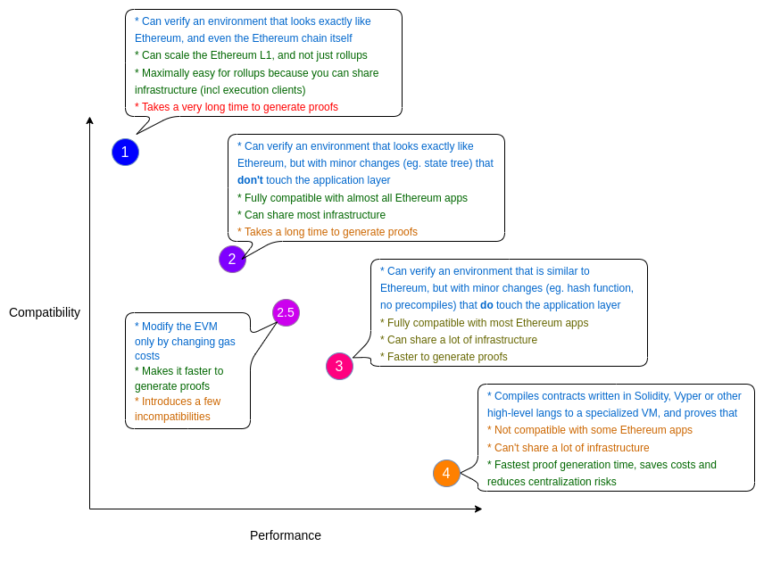
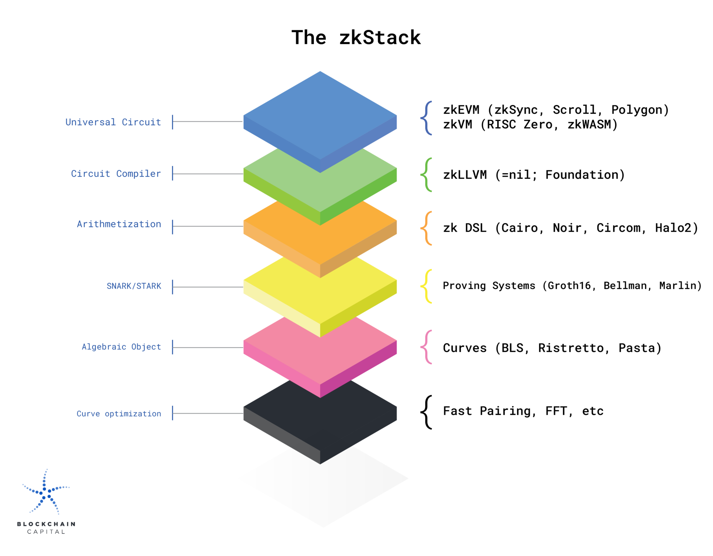
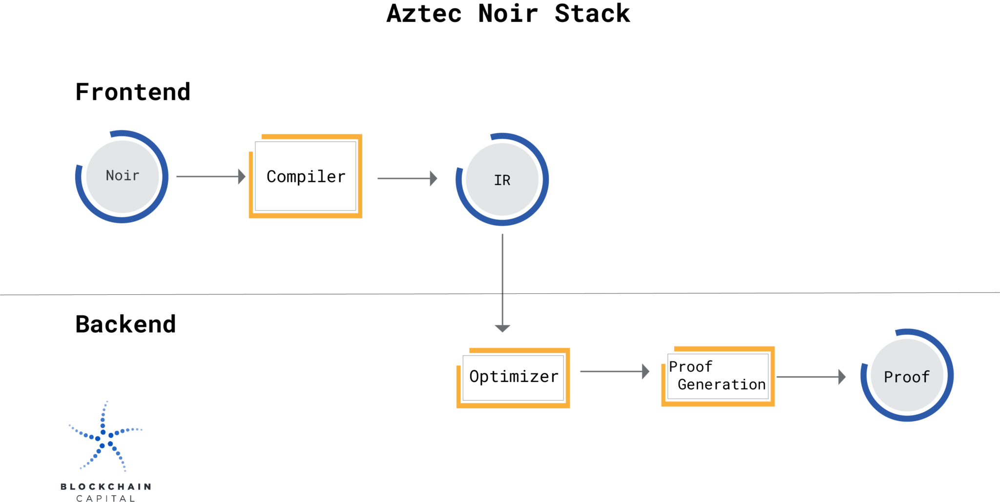
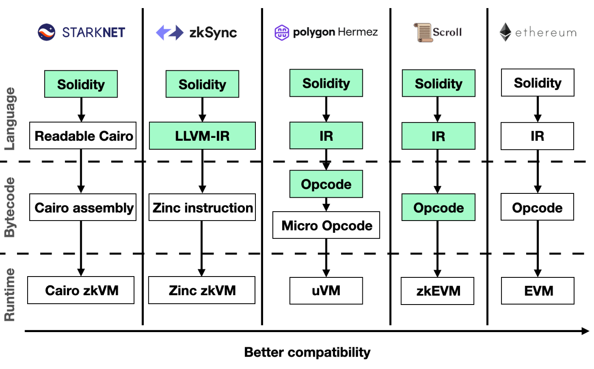
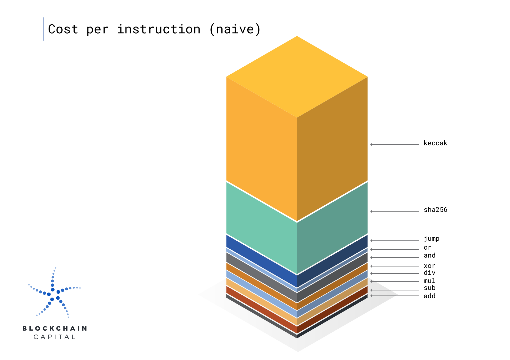
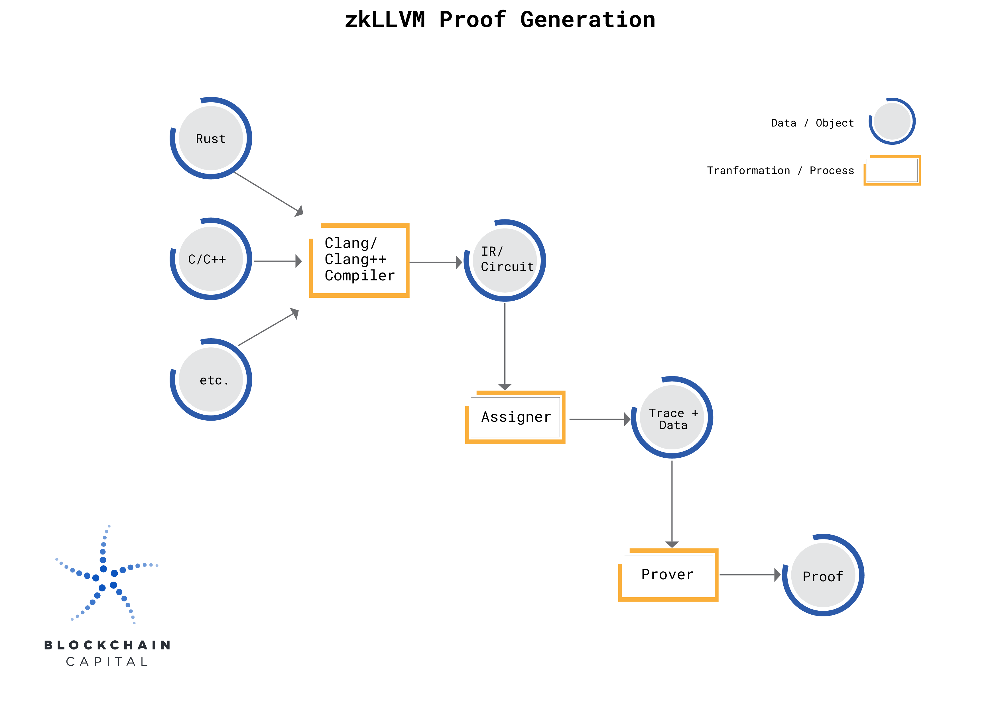
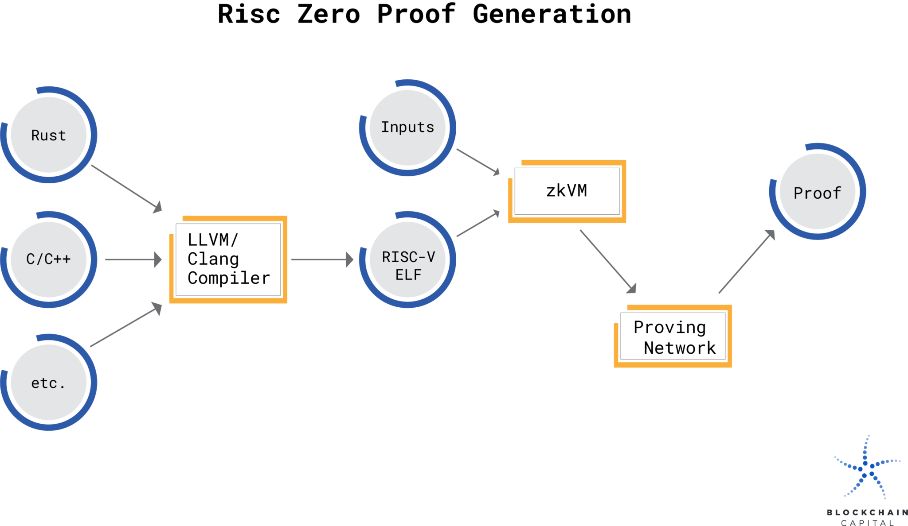
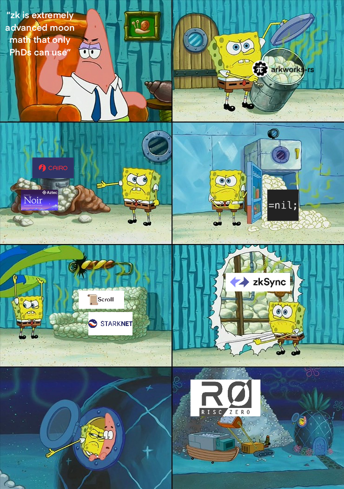

作者：Ryan Spoule

## 介绍

去年夏天，Vitalik 写了[一篇博客，概述了不同类型的 zkEVM](https://vitalik.ca/general/2022/08/04/zkevm.html)  （零知识以太坊虚拟机）。他根据性能和兼容性的权衡来定义它们。

Vitalik 在性能和兼容性之间对 zkEVM的分类

这是一种非常有启发性且实用的分类方法，可以用来区分 zkEVM 。但是，zkEVM 是构建零知识应用程序的一个子集。对于想要利用 zk 的独特性质（即 **简洁性、零知识和正确性** ）的程序员来说，zkEVM 可能不是最佳选择。通过展示所有的开发者工具，我希望提供一个指南，帮助你做出决策，为你的应用程序选择正确的 zk 堆栈。

在过去的一两年中，zk 工具取得了巨大的进步。他们正在接近普通软件开发者可以利用 zk 的强大属性，而无需深入了解令人生畏的底层数学和工程的地步。另一方面，为高级用户提供的工具激增，使 zk 专家能够精细化地控制 zk 堆栈。

## 抽象复杂性的力量

现代软件建立在无数的抽象层之上，以最大限度地提高专业分工的生产力。工程中的抽象有很多优点，例如Web 开发者不需要深入了解底层操作系统的工作原理。 

构建优秀的、可复用的抽象层的关键是封装堆栈的复杂性，然后为堆栈中的更高层提供简单但表达性强的接口以供使用。如果正确处理抽象层，可以使具有不同专业知识和领域的开发者能够跨堆栈构建有用的工具。

毫无疑问，这些原则同样适用于 zk 系统，并且这些抽象层现在正在变得足够成熟，zk 新手如今就可以开始使用它们并构建应用程序。

zk 堆栈在每一层的示例工具/技术

## 底层zk开发

### Arkworks-rs

[Arkworks-rs](https://github.com/arkworks-rs)是一个 Rust 库生态，它提供 zkSNARK 应用程序中组件的高效和安全实现。Arkworks 为开发者提供了必要的接口来为 zk 应用程序定制软件堆栈，而无需重新实现与其他现有库的共同部分。

在 Arkworks 之前，创建新的 zk 应用程序的唯一方法是从头零开始构建所有内容。Arkworks-rs 相对于定制的垂直集成工具来说，主要优势在于其灵活性水平，可以减少重复的工程开发以及审计工作。Arkworks 组件之间合理的接口组合，可以在 zk 技术创新中，使堆栈的更新保持相同的步伐，而无需强迫团队从头开始重建一切。

### 适用于谁？

Arkworks 适用于需要对整个 zk 软件堆栈进行精细把控，但又不想从头开始构建所有冗余部分的项目。如果你正在考虑电路 DSL 的自定义版本，例如，你正在制作一个新的证明系统的原型，但不确定承诺方案或相应的椭圆曲线，arkworks 将允许你在具有共享接口的多个选项之间快速切换，而不是从头开始。

**优点**
-   通过模块化实现灵活性
-   减少重复代码
    -   降低工程成本
    -   减少审计/bug范围
-   无需重大重构即可升级任何组件
-   易于在快速发展的 zk 环境中试验新功能

**缺点**
-   需要深入了解完整的软件堆栈
    -   如果没有正确理解，太多的控制反而会给自己带来麻烦
-   精细化控制需要堆栈所有层面的专业知识
    -   Arkworks 倒是提供了一些合理的默认设置。

## zk 领域特定语言 (DSL)

为了创建关于某些计算的证明，首先该计算必须以 zkSNARK 系统可以理解的形式表达。一些领域特定语言已经出现，允许应用程序开发者以这种方式表示他们的计算。其中包括 [Aztec Noir](https://aztec.network/noir/)、Starknet 的 [Cairo](https://www.cairo-lang.org/)、  [Circom](https://docs.circom.io/)、  [ZoKrates](https://zokrates.github.io/)和 Aleo 的 [Leo](https://leo-lang.org/) 等。底层证明系统和数学细节通常不会暴露给应用程序开发者。

### 开发者体验

zkApp 开发人员必须精通使用领域特定语言编写程序。其中一些语言看起来很像熟悉的编程语言，而另一些则可能很难学。让我们分析其中的一些：

[**Cairo——**](https://www.cairo-lang.org/) 在 Starknet 上构建应用程序所必需的 Starkware DSL。编译成 Cairo zkVM 可以解释的Cairo特定的汇编语言。

[**ZoKrates**](https://zokrates.github.io/)  — ZoKrates 是一个满足常见 SNARK 需求的工具包，包括用于编写电路的高级语言。ZoKrates 在椭圆曲线、证明方案和后端方面也具有一定的灵活性，允许开发人员通过简单的命令行参数进行交互。

[**Circom**](https://docs.circom.io/)  — Circom 是一种用于构建电路的专用语言。目前，它是实际生产中编写电路的语言。该语言不是特别符合人体工程学。该语言本身使你清楚得意识到你正在编写电路这一事实。

[**Leo**](https://leo-lang.org/)  ——Leo 是为 Aleo 区块链开发的语言。Leo 有一些类似 Rust 的语法，专门用于区块链内部的状态转换。

[**Noir**](https://aztec.network/noir/)  – 受 Rust 启发的语法。围绕 IR 而不是语言本身构建，这意味着它可以有任意的前端。 

值得注意的是，Aztec Noir 编译堆栈具有模块化架构

### 适用于谁？

任何想要在其应用程序中利用 zk 的独特性质的应用开发者。其中一些语言在 ZCash 和 Starknet 等链上，通过数十亿美元流动的实战测试。虽然我们讨论的一些项目还没有完全准备好投入生产环境，但使用其中一种语言编写电路是目前最好的策略，除非你需要像 Arkworks 这样的工具包提供的更精细的控制。

**优点**

-   用户无需了解底层 zk 细节
-   具有一定开发经验即可
-   链上可验证
-   不关注生态系统

缺点

-   用户需要学习新的 DSL
-   围绕每种语言的工具和支持相互独立
-   （目前）几乎无法控制底层证明堆栈

## zkEVMs

zkEVM 的主要目标是进行以太坊状态转换，并使用简洁的零知识证明来证明其有效性。正如 Vitalik 的博客中所提到的，有许多方法可以做到这一点，但有细微的差别和相应的权衡取舍。 

所有这些之间的主要技术差异就在于语言堆栈中。将计算转换为在证明系统中可使用的形式（算术化）的位置。在某些 zkEVM 中，这发生在高级语言（Solidity、Vyper、Yul）这一层，而其他方案则试图在操作码级别证明 EVM。Vitalik 的博客中深入介绍了这些方案之间的权衡取舍，但我用一句话总结来说：堆栈中转换/算术化的层级越低，性能损失就越大。

### 为什么在 zk 中证明 EVM 操作码的成本很高？

为虚拟机创建证明的主要挑战在于，电路的大小与每条指令的所有可能情况的规模大小呈线性关系。这种情况的原因是电路不知道每个程序会执行什么指令，所以它需要支持所有的指令。

在通用电路中，每条指令的成本与支持的所有指令的总和成正比

这意味着在实践中，你为最昂贵的指令（从性能成本角度看）付出代价，即使你只执行最简单的指令也是如此。这带来了通用性和性能之间的直接权衡取舍——当你为通用性添加更多指令时，你会为证明的每条指令付出代价！

这是通用电路的一个基本问题，但随着增量可验证计算（IVC, Incremental Verifiable Compute）等[新技术的发展，](https://eprint.iacr.org/2022/1758.pdf) 可以通过将计算分解成更小的块来改善这种限制，每个块都有专门的、更小的子电路。

今天的 zkEVM 实现使用不同的策略来减轻这个问题的影响......例如，zkSync 将更昂贵的操作（主要是密码学的预编译，如哈希和 ECDSA）从主要的执行证明电路剥离到单独的电路中，这些电路最后通过 snark 递归与原电路聚合在一起。zkSync 在意识到他们的大部分成本来自一些复杂的指令后采用了这种方案。

交易成本主要取决于少数昂贵的操作

从根本上说，证明 EVM 更等效的指令集成本更高的原因是，EVM 不是为 zk 计算而设计的。较早在堆栈中放弃 EVM，使得 zkEVM 可以在针对 zk 优化的指令集上运行，因此证明成本更低。

### 适用于谁？

zkEVM 是为智能合约应用程序准备，这些应用程序需要比以太坊 L1 上便宜几个数量级的交易。这些开发人员不一定具备从头开始编写 zk 应用程序的专业知识。因此，他们更喜欢用他们熟悉的高级语言编写应用程序，比如 Solidity。 

### 为什么有这么多团队在构建这个？

**扩容以太坊** 是目前最需要zk技术的应用。

zkEVM 是一种以太坊扩容解决方案，可以缓解限制 L1 dApp 开发者的拥塞问题。

### 开发者体验

zkEVM 的目标是提供尽可能接近当前以太坊开发的体验。完全的 Solidity 支持意味着团队不必构建和维护多个代码库。完美地做到这一点有些不切实际，因为 zkEVM 需要权衡取舍一些兼容性才能在合理的时间内生成合理大小的证明。

### 案例研究：zkSync 与 Scroll

zkSync 和 Scroll 之间的主要区别在于它们在堆栈中的何处/何时执行算术运算——也就是说，它们从普通 EVM 结构转换为 SNARK 表示友好的位置。对于 zkSync，发生在当他们将 YUL 字节码转换为他们自己定义的 zk 指令集时。对于 Scroll，这发生在最后 EVM 操作码生成实际执行踪迹时。

因此，对于 zkSync 而言，在生成 zk 字节码之前，一切都与 EVM 交互相同。对于 Scroll，在执行实际的字节码之前，一切都是一样的。这是一个微妙的差异，它用性能换取兼容性。例如，zkSync 不能开箱即用的那些支持 EVM 字节码工具，例如调试器，因为它是完全不同的字节码。而 Scroll 很难从指令集中获得良好的性能，因为它并不是为 zk 设计的。这两种策略各有利弊，最终有很多外生因素会影响它们的相对成功。

## zkLLVM 电路编译器

> 尽管这样命名，但 LLVM 并不是 VM（虚拟机）。LLVM 是一组编译器工具的名称，它锚定于与语言无关的中间表示 (IR) 。

=nil; Foundation（关于这个名字， 如果你想知道的话，这是一个 [SQL 注入的笑话](https://xkcd.com/327/)）正在构建一个编译器，可以将任何 LLVM 前端语言转换为可以在 SNARK 中证明的中间表示。zkLLVM 被设计为现有 LLVM 基础设施的扩展，LLVM 基础设施是一个行业标准工具链，支持许多高级语言，如 Rust、C、C++ 等。

### 如何运行

zkLLVM 的架构草图

想要证明某些计算，用户只需用 C++ 实现即可。zkLLVM 采用其修改后的 clang 编译器（当前为 C++）支持高级语言的源代码，并生成电路的一些中间表示。此时，电路已准备好进行验证，但用户可能希望根据一些动态输入来验证电路。为了处理动态输入，zkLLVM 有一个称为分配器的附加组件，它生成一个分配表，其中包含所有输入和见证，这些输入和见证已完全预处理，可以与电路一起进行证明。

这两个组件是生成证明所必需的。理论上，用户可以自己生成证明，但由于这是一项专业化的计算任务，他们可能想花钱请拥有硬件的他人为他们做这件事。对于交易对手发现机制，=nil；Foundation 还构建了一个“证明市场”，证明者竞相为支付给他们的用户证明计算。这种自由市场将使证明者优化最有价值的证明任务。

### 取舍

由于每个要证明的计算任务都是独一无二的，并且会生成不同的电路，因此证明者需要能够处理的电路数量是无限的。这种强制的通用性使得单个电路的优化变得困难。证明市场的引入允许市场对有价值的电路进行专业化优化。如果没有这个市场，将会存在自然的冷启动问题，因为说服验证者优化该电路将是一项挑战。

另一个取舍是典型的抽象与控制。愿意采用这种易于使用界面的用户正在放弃对底层加密原语的控制。对于许多用户来说，这是一个非常有效的取舍，因为让密码学专家为您做决策通常更好。

**优点**

-   用户可以用熟悉的高级语言编写代码
-   所有 zk 内部结构都与用户抽象分离
-   不依赖于增加额外开销的特定“VM”电路

**缺点**

-   每个程序都有不同的电路。难以优化。（证明市场部分解决了这个问题）
-   替换/升级内部 zk 库非常重要（需要分叉）  

## zkVM

zkVM 描述了所有 zk 虚拟机的超集，而 zkEVM 是一种特定类型的 zkVM，由于其在当下的流行，值得作为一个单独的主题进行讨论。除了定制的加密 VM 之外，还有一些其他项目正在致力于构建基于指令集架构 (ISA, Instruction Set Architecture) 的更通用的 zkVM。

系统可以证明不同的指令集架构 (ISA)，例如 RISC-V 或 WASM，而不是证明 EVM。致力于这些通用 zkVM 的两个项目是 RISC Zero 和 zkWASM。让我们在这里深入研究一下 RISC Zero，以展示该方案的工作原理以及它的一些优缺点。 

### Risc Zero

Risc 零证明生成高层架构

RISC Zero 能够证明在 RISC-V 架构上执行的任何计算。RISC-V 是一种越来越受欢迎的开源指令集架构 (ISA) 标准。RISC（精简指令集计算机）的理念是构建一个极其简单的指令集，拥有着最低的复杂度。这意味着堆栈中较高层面的开发者最终会在使用此架构实现的指令时，承担更大，但同时使硬件实现更加简单。

这种理念也适用于通用计算，ARM 芯片一直在利用 RISC 指令集，并开始主导移动芯片市场。事实证明，更简单的指令集也具有更佳的能耗和效率。

这个类比非常适合于生成 zk 证明。如前所述，在 zk 证明执行踪迹时，你需要在每个指令承担所有指令成本的总和，因此越简单越少的指令越好。

### 工作原理

从开发人员的角度来看，使用 RISC Zero 来处理 zk 证明很像使用 AWS Lambda 函数来处理后端服务器架构。开发人员只需编写代码即可与 RISC Zero 或 AWS Lambda 交互，该服务会处理所有后端复杂性。

对于 RISC Zero，开发者编写 Rust 或 C++（最终是任何以 RISC-V 为目标的语言）。然后系统将编译期间生成的 ELF 文件用作 VM 电路的输入代码。开发人员只需调用 prove 即可返回 receipt（其中包含执行踪迹的 zk 证明）对象，任何人都可以从任何地方调用“verify”。从开发者的角度来看，无需了解 zk 的工作原理，底层系统会处理所有这些复杂性。

**优点**

-   易于使用。为任何程序员打开了构建 zk 应用程序的大门
-   证明专用的单一电路
    -   攻击的范围也更小，所需的审计也更少
-   与任何区块链兼容，你只需发布证明

**缺点**

-   承担大量开销（证明大小和生成速度）来支持这样的通用接口
-   需要对证明生成技术进行重大改进，以实现对现有库的广泛支持  

## 预先构建可复用的电路

对于一些在区块链应用程序或其他地方特别有用的基本可复用电路，团队可能已经为你构建和优化了。你可以只为你的特定用例提供输入。例如，Merkle 树存在证明是加密应用程序（空投列表、Tornado Cash 等）中通常需要的东西。作为应用程序开发者，你始终可以重复使用这些经过实战检验的合约，只需修改顶层即可创建独特的应用程序。

例如，Tornado Cash 的电路可复用的 [隐私空投应用程序](https://github.com/a16z/zkdrops) 或 [隐私投票应用程序](https://github.com/BlockchainCap/zk-vote)。Manta 和 Semaphore 正在构建一个完整的工具包，包括这样的通用电路小工具，可以在 Solidity 合约中使用，而无需了解或不了解底层 zk 的月亮数学。

## 指南——选择你的堆栈

正如前文所详细所讨论的，开发 zk 应用程序有许多不同的选择，所有这些都有自己特殊的权衡取舍。此图表总结了决策矩阵，以便你根据你的 zk 专业知识水平和性能需求，选择最适合的工具。这不是一个完整的列表，计划在未来不断完善该表，因为这个领域会出现更多的工具。

## zk 应用开发速查表
--- 
###  1. 底层 Snark 库
**何时使用：** 

-   需要对整个证明堆栈进行精细控制
-   想要避免重构公共组件
-   想要试验证明方案、曲线和其他低级原语的不同组合

**何时不使用：**

-   寻找高级证明接口的新手

**方案选项：** 

-   [Arkworks-rs](https://github.com/arkworks-rs)
---
### 2. zk DSLs

**何时使用：** 

-   你可以轻松学习一门新语言
-   想使用一些经过检验的语言
-   需要最小的电路尺寸，愿意放弃抽象

**何时不使用：** 

-   需要对证明后端进行精细控制（目前可以为某些 DSL 替换后端）

**方案选项：**

-   [Circom](https://docs.circom.io/)
-   [Aztec](https://aztec.network/noir/)
-   [Cairo](https://www.cairo-lang.org/)
-   [ZoKrates](https://zokrates.github.io/)
-   [Leo](https://leo-lang.org/)

---

### 3. zk 编译器

**何时使用：** 

-   不愿意承担通用电路的开销
-   想用熟悉的语言编写电路 
-   需要高度定制的电路

**何时不使用：** 

-   想要控制底层加密原语
-   需要一个已经高度优化的电路

**方案选项：**

-   [=nil;'s' zkLLVM](https://github.com/NilFoundation/zkllvm)

---
### 4.zkEVM

**何时使用：** 

-   你有一个已经在 EVM 上运行的 dApp
-   你需要为用户提供更便宜的交易 
-   你希望将部署到新链的工作量降到最低
-   只关心zk的简洁性（压缩）

**何时不使用：** 

-   你需要完美的 EVM 等效性
-   你需要 zk 的隐私属性 
-   你有一个非区块链用例 

**方案选项：**

-   [zksync2.0](https://zksync.io/)
-   [Polygon zkEVM](https://polygon.technology/)
-   [Scroll](https://scroll.io/)
-   [Starknet](https://starkware.co/starknet/)
---
### 5.zkVM

**何时使用：** 

-   想用高级语言写代码 
-   需要证明执行的正确性 
-   需要向验证者隐藏此执行的一些输入
-   你对 zk 底层几乎不了解

**何时不使用：**

-   在极低延迟的环境中（它仍然很慢）
-   你（目前）有一个庞大的程序

**方案选项：**

-   [RISC Zero](https://www.risczero.com/)
-   [zkWASM](https://delphinuslab.com/zk-wasm/)
---

### 6.预先构建可复用的电路

**何时使用：** 

-   你有一个智能合约应用程序依赖于常见的 zk 构建模块，例如 Merkle inclusion
-   你对 zk 底层几乎不了解

**何时不使用：**

-   你有高度专业化的需求
-   不支持你的用例 

**方案选项：**

-   [Manta Network](https://github.com/Manta-Network)
-   [Semaphore](https://semaphore.appliedzkp.org/)

## 结论

zk 处于多项技术的前沿，构建它需要对数学、密码学、计算机科学和硬件工程有深刻的理解。然而，随着每天都有越来越多的抽象层可用，应用程序开发人员无需博士学位即可利用 zk 的强大功能。随着时间的推移，通过对堆栈的所有级别进行优化，证明时间的限制会逐渐解除，我们可能会看到面向普通开发者的更简单工具。

充满好奇的开发者，我希望我说服了你。你从今天开始就可以在你的应用程序中使用 zk。Happy Hacking !

还在等什么，快去构建 zk 应用吧！

---

**披露：** _Blockchain Capital 是上述几个协议的投资者。_

每篇博文中表达的观点可能是每位作者的个人观点，并不一定反映 Blockchain Capital 及其关联公司的观点。Blockchain Capital 和作者均不保证每篇博文中所提供信息的准确性、充分性或完整性。Blockchain Capital、作者或任何其他人未就任何博客文章中包含的信息的准确性、完整性或公平性作出或提供任何明示或暗示的陈述或保证，并且对于任何此类信息不承担任何责任或义务。每篇博文中的任何内容均不构成投资、监管、法律、合规或税务或其他建议，也不应作为投资决策的依据。博客文章不应被视为当前或过去的建议或招揽购买或出售任何证券或采用任何投资策略的要约。博客文章可能包含预测或其他前瞻性陈述，这些陈述基于可能因许多可能事件或因素而改变信念、假设和期望。如果发生变化，实际结果可能与前瞻性陈述中表达的结果存在重大差异。所有前瞻性陈述仅在作出此类陈述之日起生效，除法律要求外，Blockchain Capital 和每位作者均不承担更新此类陈述的任何义务。如果任何博客文章中引用了由 Blockchain Capital 制作、发布、演示文稿或其他材料，或者其他方式分发的任何文件，请仔细阅读如上声明。